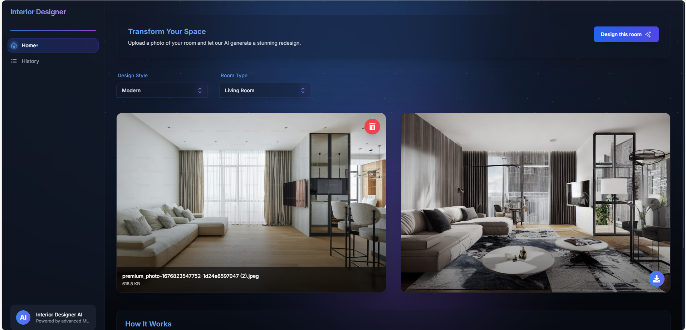
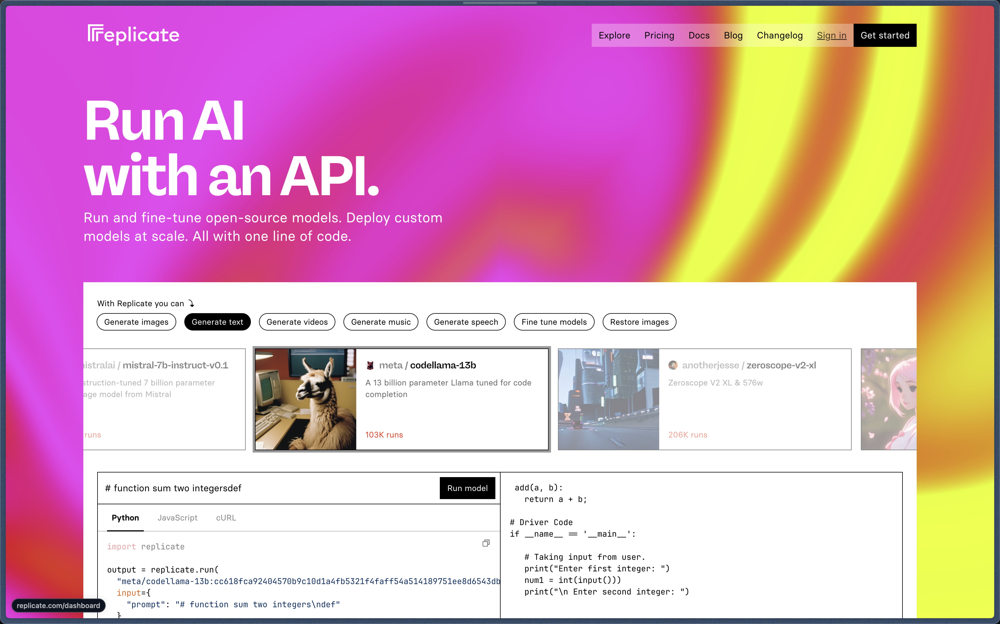
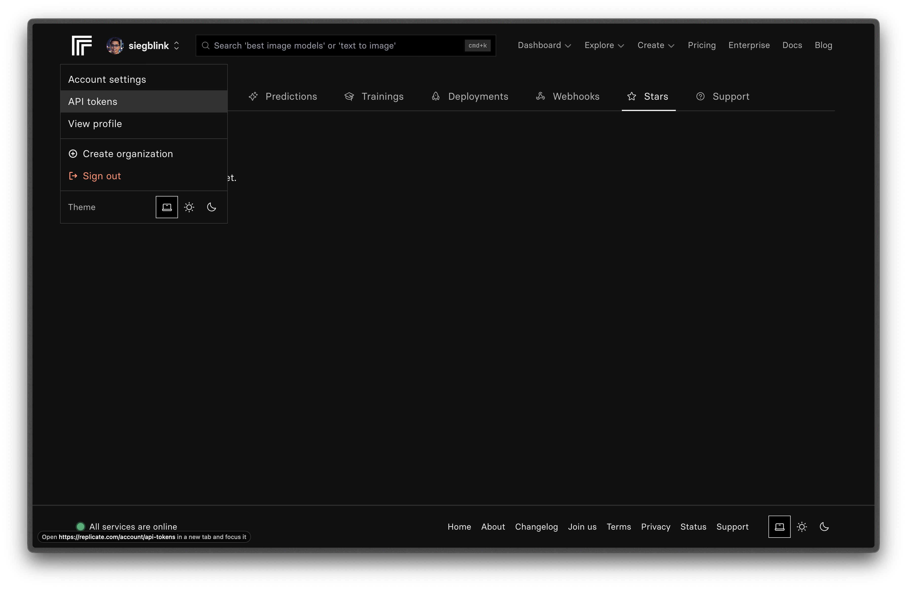
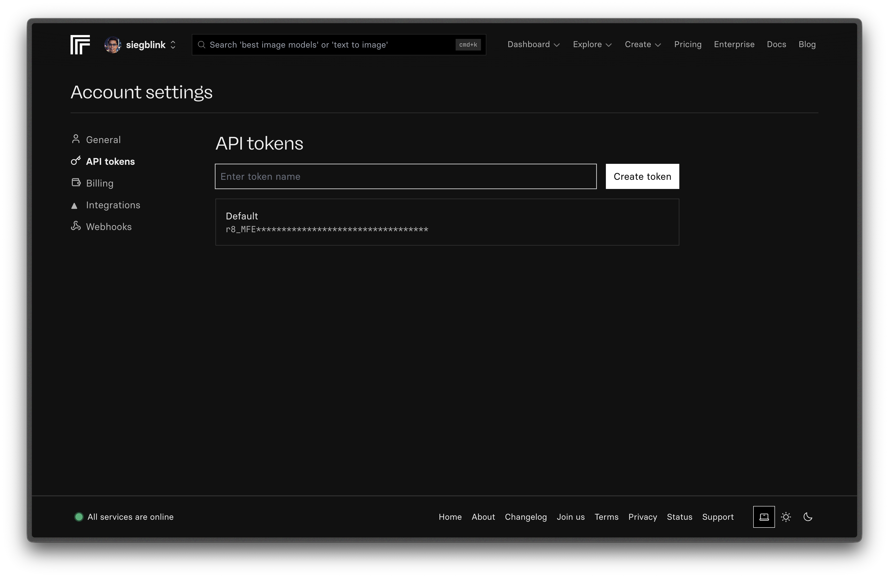
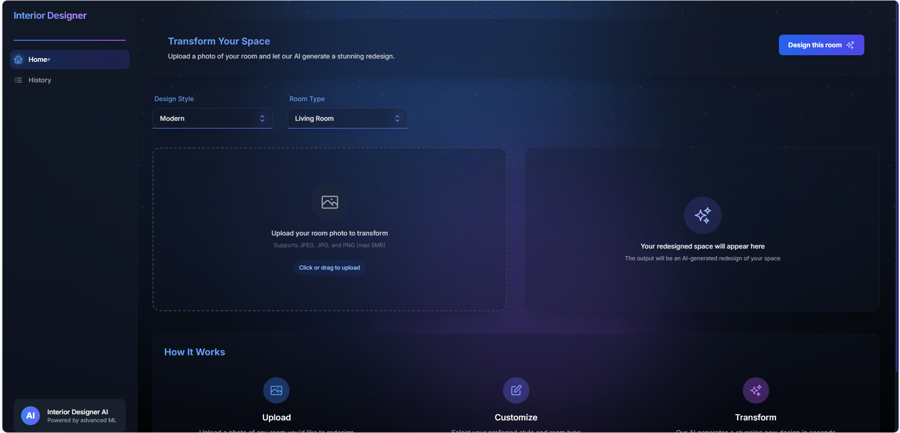

## Interior Designer AI



## How to use

### 1. Clone this project's repository

In your Terminal app

- Type `git clone git@github.com:siegblink/interior-designer-ai.git`
- Or type `git clone https://github.com/siegblink/interior-designer-ai.git`

### 2. Install the project dependencies

Go to the project's directory

- Type `cd interior-designer-ai`
- Then, `npm install`

### 3. Create an account at [replicate](https://replicate.com/)



### 4. Go to the _API tokens_ page within your replicate account



### 5. Create your API token and copy it



### 6. Rename the `.env.example` file to `.env.local`

### 7. In `.env.local`, replace the placeholder _your_api_token_ with your API token

```
# Replace 'your-api-token' with your own API token from replicate
REPLICATE_API_TOKEN=your_api_token
```

### 8. Run the project

Back in your Terminal in the project directory, type `npm run dev`

### 9. See the running application in your browser at `localhost:3000`


